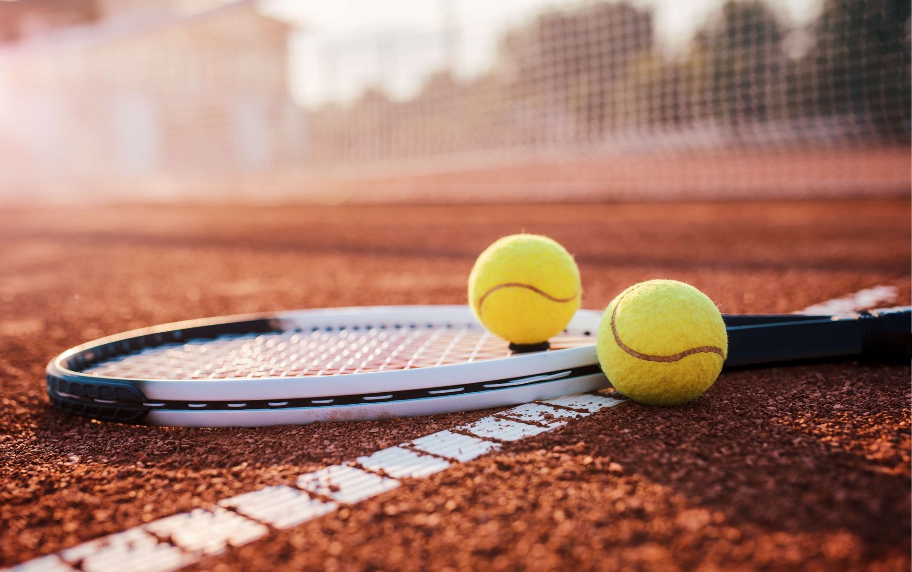
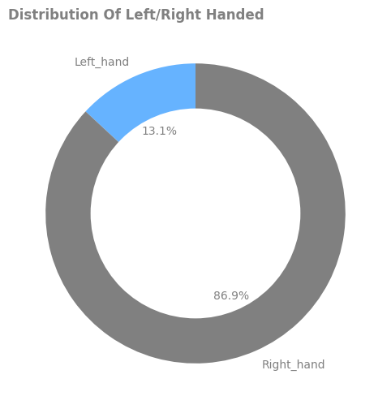
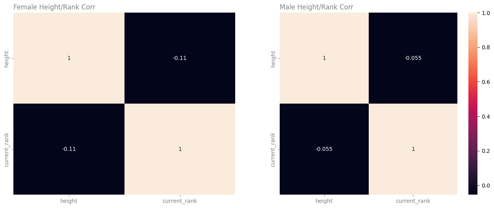
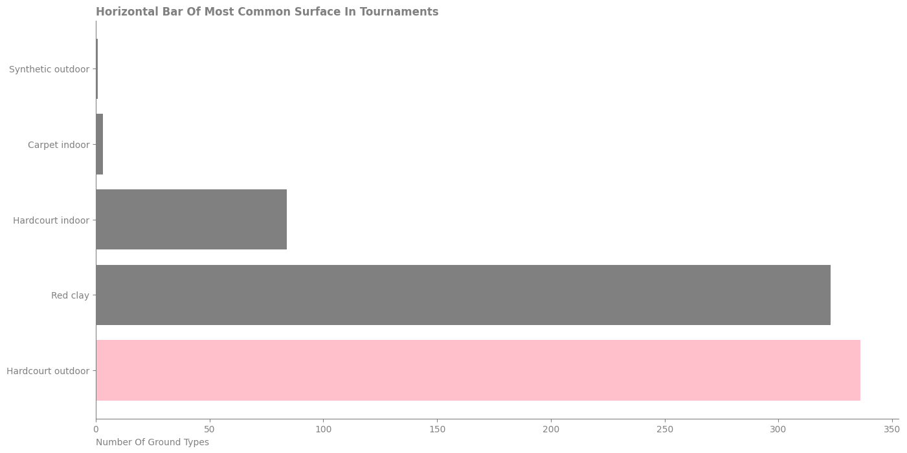
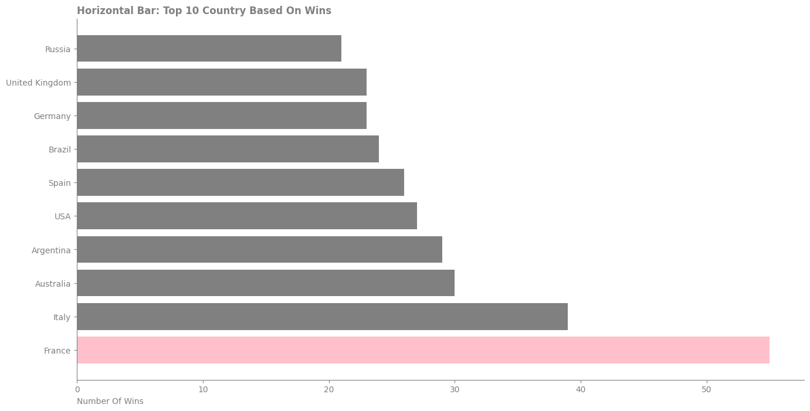

# Analysis Of Tennis Matches

This project is about analysis of tennis matches and data was gathered in two months from sep 2023 to oct 2023. Data set has fifteen data frames about home and away team, all matches features, odds and etc. This was a raw data set that required processes from cognition of tables and contents to cleaning process and managing inappropriate contents.

## Requirements

This project requires the following modules:
- numpy
- pandas
- seaborn
- matplotlib 
- notebook

## Python Packages Used

- General Purpose: pathlib, os, and many more.
- Data Manipulation: Packages used for handling and importing dataset such as pandas, numpy.
- Data Visualization: Include packages which were used to plot graphs such as seaborn, matplotlib.

## Code structure

```
├── tennis_data_20231212
│   ├── raw_match_parquet
│   ├── raw_odds_parquet
│   ├── raw_point_by_point_parquet
│   ├── raw_statistics_parquet
│   ├── raw_tennis_power_parquet
|   └── raw_vote_parquet
├── images
├── tennis_project_data_analysis.ipynb
├── README.md
└── .gitignore
```

## Data section

* Data structure description
    - List of tables
        - home_team
        - home_team_score
        - away_ream
        - away_ream_score
        - event
        - vote
        - venue
        - tournament
        - odds
        - power
        - game
        - time
        - round
        - season
        - period
    - File formats
        - .parquet files

## Results

This analysis on one hand shows some information about players like distribution of left/right handed, ranks, correlation between height and rank and etc.
For example what is distribution of left/right handed plyers:





Or correlation between a player's height and their ranking:





On the other some analysis about matches has been done, like number of wins, number of championships for each countries and ect.
For example what is the most common type of surface used in tournaments?





or finding top 10 countries based on number of wins.





For future work an ML model will reveal more aspect of data.
